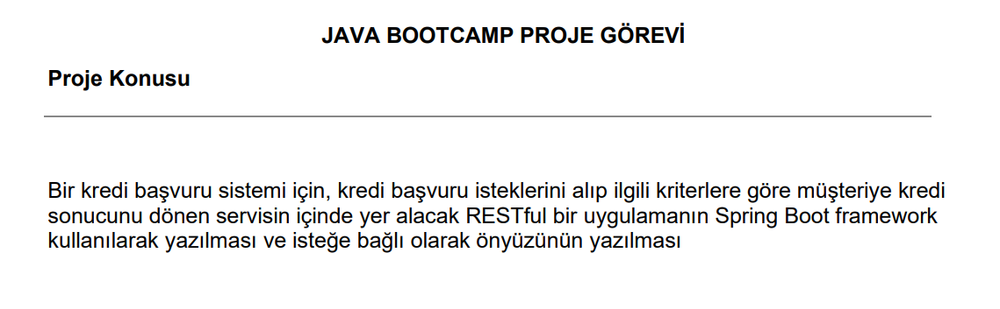
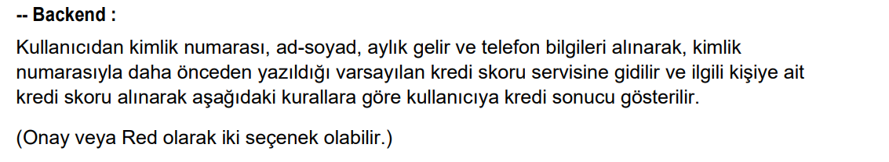

# LOAN APPLICATION SYSTEM BOOTCAMP GRADUATION PROJECT



`BACKEND->`





## Spring Boot Nedir ? Ne işe Yarar

<p>
Spring Framework kullanarak uygulama geliştirirken xml
dosyaları üzerinden konfigürasyon işlemlerini yapmaktayız. Bu işlemler proje büyüdükçe vakit alabiliyor.
Spring Boot ise bu vakit kaybını en aza indirmeyi planlayan bir başka Spring Freamework’üdür.

Spring Boot sadece koda odaklanmayı sağlamayı
amaçlamakta olup bizi xml dosyaları üzerindeki
vakit kaybını ortadan kaldırır. Xml dosyaları ile uğraşmadan Spring tabanlı uygulamaları hemen geliştirebileceğimiz
Spring Boot ile yapabilecekleriniz sınırsız.

Spring Boot uygulama türüne göre uygulama ayarlarını varsayılan-otomatik ayar özelliği ile yaparak daha hızlı uygulama geliştirmeyi sağlar. Ayrıca sağladığı geniş ve dinamik ayar tanımlama özelliği sayesinde varsayılan veya uygulama içerisinde kullanılacak 
ayarların kolay bir şekilde belirlenmesini sağlar
</p>


```URL:``` En basit şekilde tanımlayacak olursak, bir web sitesine erişirken kullandığımız adres diyebiliriz. Oluşturduğunuz API'ın da bir adresi olur ve bu adres üzerinden ona erişir, diğer servislerle bağlarsınız.`<br>

```Endpoint:``` API üzerinde belirli bir amaç için oluşturulmuş metodunuza verilen isim.<br>

```HTTP:``` Günümüz web teknolojisinde en yaygın kullanılan sunucu ve istemci arasındaki haberleşme protokolüdür. Genelde bir web sitesi üzerinde dolaşırken GET ve POST HTTP isteklerini yaygın olarak kullanırsınız fakat göreceksiniz ki API içerisinde farklı istek türleri de kullanılmakta.<br>

```İstek(HTTP Request);``` API üzerinde oluşturduğumuz çeşitli özellikteki endpoinlere, HTTP protokolü kullanarak yaptığınız taleplere denir.

## REST Mimarisi ve RESTful Servisler
<br>
<p>
RESTful API, iki bilgisayar sisteminin internet üzerinden güvenli bir şekilde bilgi alışverişi yapmak için kullandığı bir arabirimdir.
Çoğu iş uygulaması, çeşitli görevleri gerçekleştirmek için diğer dahili ve üçüncü taraf uygulamalarla iletişim kurmak zorundadır. Örneğin,
aylık olarak maaş bordroları oluştururken faturalandırmayı otomatik hale getirmek ve dahili bir zaman çizelgesi uygulamasıyla iletişimde olmak için dahili hesap sisteminizin,
verileri müşterinin bankacılık sistemiyle paylaşması gerekir. RESTful API'ler; güvenli, güvenilir ve verimli yazılım iletişim standartlarını izlediğinden bu bilgi alışverişini destekler.

**Api Nedir ?**
<br>
Uygulama programlama arabirimi (API), 
diğer yazılım sistemleriyle iletişim kurmak için uymanız gereken kuralları tanımlar. Geliştiriciler, diğer uygulamaların kendi uygulamalarıyla programlama yoluyla iletişim kurabilmesi için API'ler sunar veya oluşturur.
Örneğin, zaman çizelgesi uygulaması, bir çalışanın tam adını ve bir tarih aralığını soran bir API sunar. Uygulama, bu bilgileri aldıktan sonra çalışanın zaman çizelgesini dahili olarak işler ve söz konusu tarih aralığında tamamlanan çalışma saatlerini bildirir.

Bir web API'sini, web'deki istemciler ile kaynaklar arasındaki bir ağ geçidi olarak düşünebilirsiniz.


**Rest Nedir ?**
<br>
Temsili Durum Aktarımı (REST), bir API'nin nasıl çalışması gerektiğine ilişkin koşulları uygulamaya koyan bir yazılım mimarisidir. REST, başlangıçta internet gibi karmaşık bir ağdaki iletişimi yönetmek için bir kılavuz olarak oluşturulmuştu. REST tabanlı mimariyi yüksek performanslı ve güvenilir iletişimi doğru ölçekte desteklemek için kullanabilirsiniz. Bu mimariyi kolayca uygulayabilir, değiştirebilir ve böylece, herhangi bir API sistemine görünürlük ve platformlar arası taşınabilirlik sağlayabilirsiniz.

API geliştiricileri, birkaç farklı mimariyi kullanarak API'ler tasarlayabilir. REST mimari stiline uygun API'lere REST API'ler adı verilir. REST mimarisini uygulayan web hizmetlerine RESTful web hizmetleri adı verilir. RESTful API terimi genellikle RESTful web API'lerini ifade eder. Bununla birlikte, REST API ve RESTful API terimlerini birbirinin yerine kullanabilirsiniz.


</p>


## RESTful API'lerin avantajları nelerdir?
<p>

**Ölçeklenebilirlik:**
<br>

REST, istemci-sunucu etkileşimlerini optimize ettiğinden, REST API'leri uygulayan sistemler verimli şekilde ölçeklendirme yapabilir. Durumsuzluk; sunucunun, geçmiş istemci istek bilgilerini saklaması gerekmediğinden sunucu yükünü ortadan kaldırır. İyi yönetilen önbelleğe alma süreci, bazı istemci-sunucu etkileşimlerini kısmen veya tamamen ortadan kaldırır. Tüm bu özellikler, performansı azaltan iletişim tıkanıklıklarına neden olmadan ölçeklendirmeyi destekler.

**Esneklik:**
<br>
RESTful web hizmetleri, toplam istemci-sunucu ayrımını destekler. Bu hizmetler, her bir parçanın bağımsız olarak gelişebilmesi için çeşitli sunucu bileşenlerini basitleştirir ve birbirinden ayırır. Sunucu uygulamasındaki platform veya teknoloji değişiklikleri, istemci uygulamasını etkilemez. Uygulama işlevlerini katmanlama özelliği, esnekliği daha da artırır. Örneğin, geliştiriciler uygulama mantığını yeniden yazmadan veritabanı katmanında değişiklikler yapabilir.

**Bağımsızlık:**
<br>
REST API'ler, kullanılan teknolojiden bağımsızdır. API tasarımını etkilemeden hem istemci hem de sunucu uygulamalarını çeşitli programlama dillerinde yazabilirsiniz. Ayrıca, iletişimi etkilemeden her iki taraftaki temel teknolojiyi de değiştirebilirsiniz.


</p>

##  RESTful API'ler nasıl çalışır?

<p>

Bir RESTful API'nin temel işlevi, internette gezinmeyle aynıdır. İstemci, bir kaynağa ihtiyaç duyduğunda API'yi kullanarak sunucu ile iletişime geçer. API geliştiricileri, istemcinin REST API'yi nasıl kullanması gerektiğini sunucu uygulamasının API belgelerinde açıklar. Herhangi bir REST API çağrısına yönelik genel adımlar şunlardır:<br>
1-) İstemci, sunucuya bir istek gönderir. İstemci, isteği sunucunun anlayacağı şekilde biçimlendirmek için API belgelerine uyar.<br>

2-)Sunucu, istemcinin kimliğini doğrular ve istemcinin bu istekte bulunma hakkı olduğunu onaylar.<br>

3-)Sunucu, isteği alır ve dahili olarak işler. <br>

4-)Sunucu, istemciye bir yanıt verir. Yanıt, istemciye isteğin başarılı olup olmadığını söyleyen bilgileri içerir. Yanıt aynı zamanda, istemcinin talep ettiği bilgileri de içerir.<br>

REST API isteği ve yanıt ayrıntıları, API geliştiricilerinin API'yi nasıl tasarladığına bağlı olarak küçük farklılıklar gösterir.


</p>

## RESTful API istemci isteği neleri içerir?
<p>

Sunucu, her bir kaynağı benzersiz kaynak tanımlayıcılarla tanımlar. REST hizmetlerinde sunucu, kaynak tanımlamasını genellikle Tekdüzen Kaynak Konum Belirleyicisi'ni (URL) kullanarak gerçekleştirir. URL, kaynağa giden yolu belirtir. URL, herhangi bir web sayfasını ziyaret etmek için tarayıcınıza girdiğiniz web sitesi adresine benzer. URL'ye aynı zamanda istek uç noktası adı da verilir ve URL, istemcinin ne gerektirdiğini sunucuya açıkça belirtir.
</p>


<p>

### GET

İstemciler, sunucuda belirtilen URL'de yer alan kaynaklara erişmek için GET isteğini kullanır. İstemciler, GET isteklerini önbelleğe alabilir ve sunucuya verileri göndermeden önce filtreleme talimatı vermek için RESTful API isteğinde parametreler gönderebilir.

### POST

İstemciler, verileri sunucuya göndermek için POST isteğini kullanır. Veri gösterimini de isteğe dahil ederler. Aynı POST isteğini birden fazla kez göndermek, aynı kaynağın birden fazla kez oluşturulmasına neden olur.

### PUT

İstemciler, sunucudaki mevcut kaynakları güncellemek için PUT yöntemini kullanır. POST'un aksine, RESTful web hizmetinde aynı PUT isteğini birden fazla kez göndermek aynı sonucu doğurur.

### DELETE

İstemciler, kaynağı kaldırmak için DELETE isteğini kullanır. Bir DELETE isteği, sunucunun durumunu değiştirebilir. Bununla birlikte, kullanıcı uygun kimlik doğrulamasına sahip değilse istek başarısız olur.


</p>


<br>


## HTTP STATUS CODES

<p>
HTTP status codes<br>

`1XX` ile başlayan kodlar bilgi amaçlı kodlardır.<br>
`2XX` ile başlayan kodlar başarı kodlarıdır.<br>
`3XX` ile başlayan kodlar yönlendirme kodlarıdır.<br>
`4XX` ile başlayan kodlar ise client(istemci) hatası kodlarıdır.<br>
`5XX`ile başlayan kodlar ise server(sunucu) hatası kodlarıdır.<br>


</p>


## Rest Vs SOAP


Bu kadar REST anlattıktan sonra insanın aklına SOAP mı? REST mi? sorusu geliyor elbette :)

Bana sorarsanız bir Web Servis tasarlarken önce REST’i deneyin, (yapamadığınız şeyler olursa ki bu durumlar çok az) SOAP’ı deneyin. Bu aşamada karşılaştırmalı gitmekte yarar var.

**REST’in avantajları nelerdir ;**

 + Hafiftir, kolay extend edilebilir.
 + Gelen, giden data boyutu SOAP ile karlılaştırıldığında çok ufaktır
 + Tasarlaması kolaydır ve implementasyonu kolaydır, herhangi bir ekstra tool’a ihtiyacı yoktur
 + HTTP üzerinden çalışır, platform bağımsızdır


**SOAP’ın avantajları ;**

+ Consume etmesi kolaydır, bir şemayla beraber gelir
+ Type-safety’dir, sizi bu tür validasyonlarla uğraştırmaz
+ Bir sürü development tool’u vardır
+ Security implementasyonu REST’e göre daha kolaydır, bir sürü hazır yapı vardır.
<br>


  En genel manada ikisinin de avantajları bunlar. Benim görüşüm enterprise uygulamalarda SOAP daha kolay bir çözüm olabiliyor. Onun haricinde dediğim gibi SOAP ile yapıpta REST ile yapamayacağınız hiç birşey yok. O yüzden önce REST’i deneyin her zaman.


